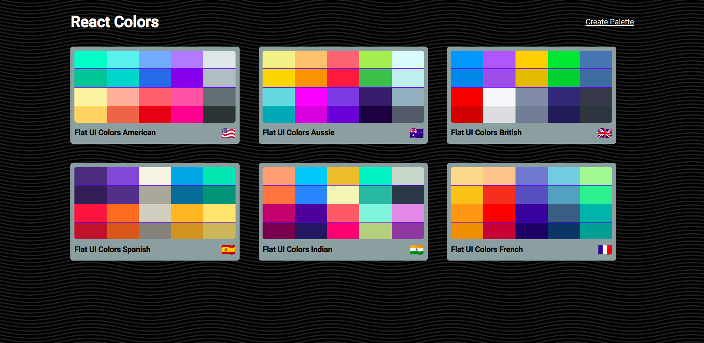
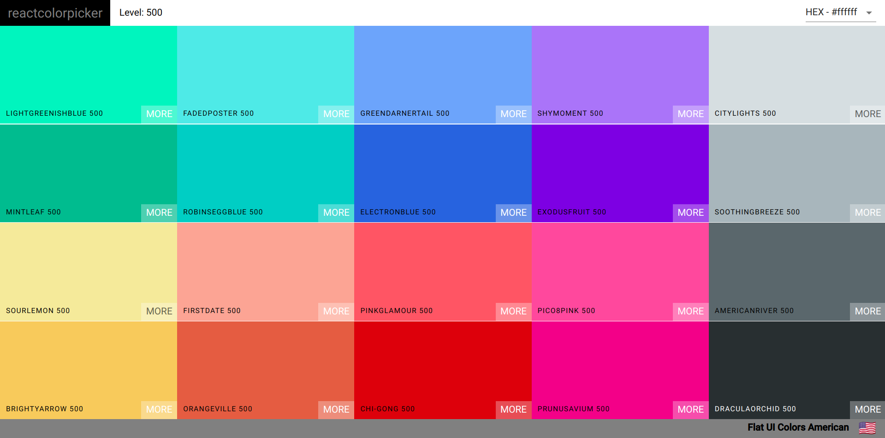
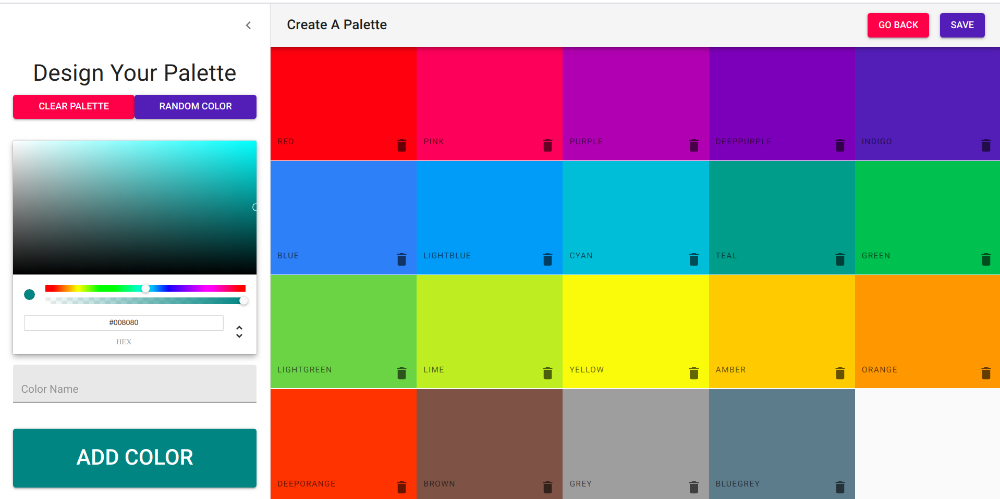
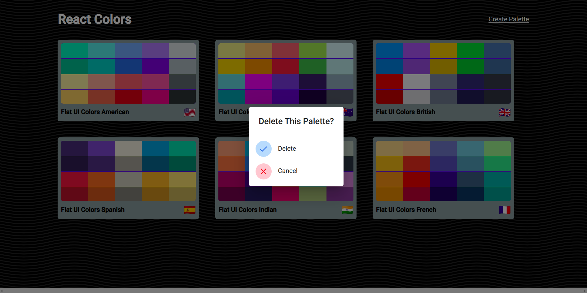

It is very hard to find the color name or code which you like and you want to use it in your project, application,websites,etc.
But think up of an application which is filled of colors which you desire off. Now your wait is over by this application.
In this application you can have all that colors code which you want by just a click. The app will cpy the code of the color 
itself in your system and you can paste it at anywhere. HAPPY JOURNEY!!!!!!!!!!!!!!!!!!  

